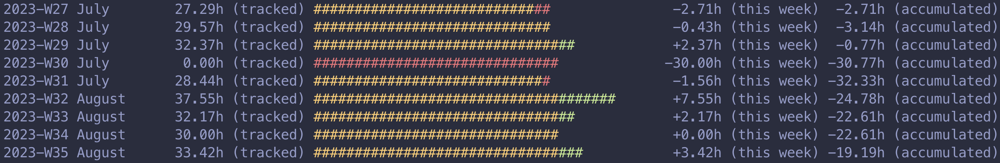

# Harvest Time Tracker Analysis Tool

This project is designed to interact with the Harvest time tracking API to analyze and report on time entries for a specified user within a given date range.

It calculates the expected hours per week based on user input and compares it with the actual tracked hours, providing a detailed report on the discrepancies and accumulated overtime.

Disclaimer: Only if you have entered **all your hours** in Harvest (incl. holidays, bank holidays, sick leave...), you will get an accurate overview.

## Features

- Fetch time entries from the Harvest API for a specified user and date range.
- Calculate expected hours per week and compare them with actual tracked hours.
- Group time entries by ISO week for detailed analysis.
- Report on discrepancies between expected and actual hours, including accumulated overtime.
- Environment variable configuration for easy setup and use.
- [2 endpoints](#curl) for curl commands

## Pre-requisists

- [Install Cargo](https://doc.rust-lang.org/cargo/getting-started/installation.html)

- [Get your Harvest Access Token](https://id.getharvest.com/oauth2/access_tokens/new)

- Get your your `account_id` and `user_id` from the Harvest website:
    - `user_id`: click on your name in the top right hand corner, then select "my profile". Your ID will appear in the URL: `https://<your_harvest_account_name>.harvestapp.com/people/<YOUR_USER_ID>`
    - `account_id`: ask your account manager as this is a unique ID for all members

## How to run

The tool requires several environment variables to be set before running:

- `HARVEST_ACCOUNT_ID`: Your Harvest account ID
- `HARVEST_ACCESS_TOKEN`: Your Harvest access token for authentication
- `HARVEST_USER_ID`: Your Harvest user ID
- `WEEKLY_HOURS`: Expected hours to work per week
- `FROM`: Start date of the analysis period (format: YYYY-MM-DD)
- `TO`: End date of the analysis period (format: YYYY-MM-DD)

Both the `FROM` and `END` dates are inclusive.

Example:

```bash
export HARVEST_ACCOUNT_ID="YOUR_ACCOUNT_ID"
export HARVEST_ACCESS_TOKEN="YOUR_ACCESS_TOKEN"
export HARVEST_USER_ID="YOUR_USER_ID"
export WEEKLY_HOURS="30"
export FROM="2023-04-01"
export TO="2023-04-10"
```

Navigate to the project directory in your terminal and simply run the programm using cargo: 

```bash
cargo run
```

The output contains the following columns:

- Year with week number of the year, e.g. `2021-W08` indicates the 8th week of the year 2021
- Month name, e.g `August`
- Tracked hours of the week
- Visualization of your hours +/- the difference with regard to your `WEEKLY_HOURS`
- Time difference for the week with regard to your `WEEKLY_HOURS`
- Accumulated overtime difference since the beginning of the given period

### Example Output



## Tests

```rust
cargo test
```

If you wish to get debug statements, add the `--nocapture` flag. Note the `--` needed before the flag itself.

```rust
cargo test -- --nocapture
```

# Contributing

Contributions are welcome! If you have suggestions for improvements or encounter any issues, please feel free to open an issue or submit a pull request.


--- 

## Curl

### Route `stats.json`, for a Json output:

Locally

```curl
curl "http://localhost:3000/stats.json?harvest_user_id=$HARVEST_USER_ID&harvest_token=$HARVEST_ACCESS_TOKEN&harvest_account_id=$HARVEST_ACCOUNT_ID&from=$FROM&to=$TO&expected_hours_per_week=$WEEKLY_HOURS" | jq
```

Online version: replace `http://localhost:3000` with `https://harvest-overtime.fly.dev`

### Route `stats.ansi`, for a colored outout in terminal:

Locally

```curl
 curl "http://localhost:3000/stats.ansi?harvest_user_id=$HARVEST_USER_ID&harvest_token=$HARVEST_ACCESS_TOKEN&harvest_account_id=$HARVEST_ACCOUNT_ID&from=$FROM&to=$TO&expected_hours_per_week=$WEEKLY_HOURS"
 ```

 Online version: replace `http://localhost:3000` with `https://harvest-overtime.fly.dev`

## UI from your favourite browser

1. Online version: go to [harvest-overtime.fly.dev](https://harvest-overtime.fly.dev/)

or

2. When running locally go to: [http://localhost:3000](http://localhost:3000/)
